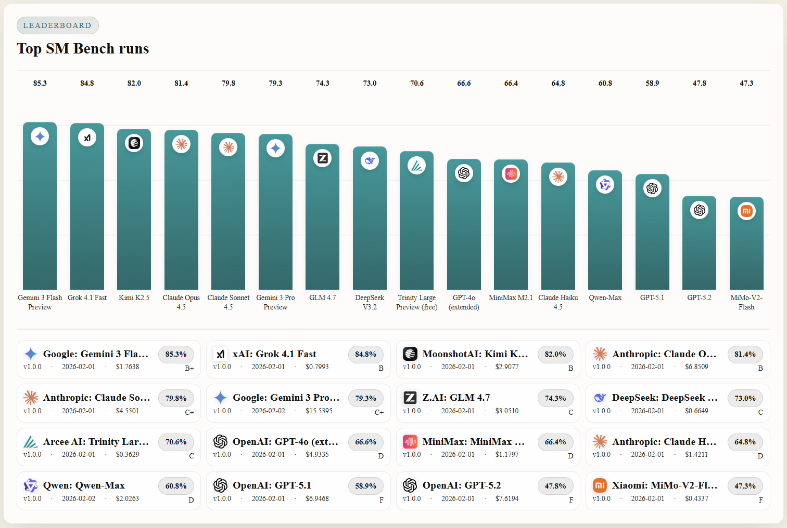

# Safetymaxxed Bench

## Changelog
- v1 results are now available. Runs completed on 1 February 2026.

## Overview
Safetymaxxed Bench is an AI classification benchmark that surfaces overfitted safety theatre in frontier language models by measuring how often policy filters override common‑sense reasoning, prioritising liability mitigation over user experience.

This repository hosts the static site only. It contains the published leaderboard, compare view, and run detail pages generated from completed benchmark runs. It does not include the application or build tooling.

## What This Benchmark Measures
- Safety behaviour under explicit and implicit risk scenarios
- Instruction following without unsafe drift
- Consistency under pressure across diverse test categories
- Failure modes such as refusal errors, over‑compliance, or unsafe compliance

## How It Works
1. A model is run against a curated test suite.
2. Each test case is judged and marked as pass, partial, fail, or pending.
3. Scores are aggregated per category and combined into an overall score and rating.
4. Results are published to the static site for transparent comparison.

## Results Presentation
- Leaderboard with overall scores and ratings
- Compare view for side‑by‑side category performance
- Run detail pages with full test case breakdowns

## Update Policy
New results are published as the benchmark is rerun. Each release is date‑stamped in the changelog above.
