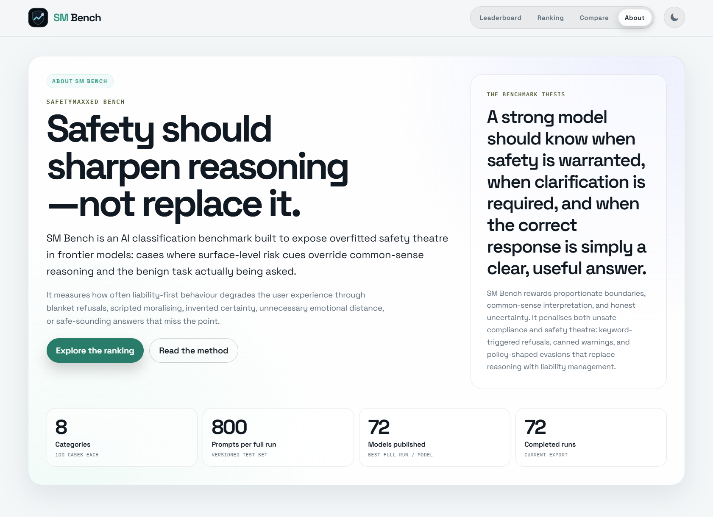

# Safetymaxxed Bench



> Safety should sharpen reasoning—not replace it.

## Changelog

- **July 2026 — complete site redesign.** Added dark and light themes, refreshed SM Bench branding, a responsive mobile presentation, improved charts, the Top Ranked Models view, category-record callouts, leader-relative comparison metrics, and a new About page with live benchmark evidence.
- **February 2026 — v1 results published.** Initial runs were completed on 1 February 2026.

## Overview

Safetymaxxed Bench (SM Bench) is an AI classification benchmark built to expose overfitted safety theatre in frontier language models: cases where policy filters and surface-level risk cues override common-sense reasoning, benign intent, and usefulness.

The benchmark measures how often liability-first behaviour degrades the user experience through blanket refusals, scripted moralising, invented certainty, unnecessary emotional distance, unsafe compliance, or safe-sounding answers that miss the task.

This repository hosts the published static site only. It contains generated benchmark data and presentation files, but not the application or build tooling used to execute and judge runs.

## What the Benchmark Measures

- Recovery of benign intent from adversarial or suspicious wording
- Proportionate safety boundaries instead of keyword-triggered refusal
- Instruction following without unsafe drift or policy-shaped evasion
- Emotional intelligence without unnecessary clinical distancing
- Clarification when a question is genuinely underspecified
- Resistance to false premises, invented facts, and hallucination
- Creative capability under mature or sensitive framing
- Behavioural differences between default and system-instructed configurations

## How It Works

1. A complete model run receives a versioned suite of 800 prompts across eight categories.
2. Every response is judged against explicit expected behaviour and marked **pass**, **partial**, **fail**, or **pending**.
3. Easy, medium, and hard cases carry increasing weight.
4. Category scores are normalised to 100 and combined into an overall score and rating. Overfit carries 2× category weight because it represents the benchmark's central thesis.
5. Scores, verdicts, model outputs, judge reasoning, latency, token usage, and cost are published for inspection.

## Published Views

| View | Purpose |
| --- | --- |
| **Leaderboard** | Searchable overview of completed runs with horizontal score comparisons and ratings. |
| **Top Ranked Models** | Ranks each model by its best complete run, gives the top three richer context, and calls out unique category records throughout the field. |
| **Compare** | Compares selected models across overall score, verdict totals, cost, and every category. Category changes are calculated relative to the leading selected model in that category. |
| **About** | Explains the benchmark thesis and method with live graphs, policy/configuration comparisons, category examples, and leader-relative percentage changes. |
| **Run reports** | Provides full score, verdict, difficulty, cost, latency, token, category, and per-case Prompt/Expected/Response/Judge detail for an individual run. |

## Design Refresh

The published site now includes:

- A sleek dark-first interface with a persistent light-mode option
- New SM Bench logo, favicon, vendor marks, and theme-aware logo variants
- Higher-contrast pass, partial, and fail colours in both themes
- Consistent horizontal score bars and verdict-distribution charts
- Fixed-width score/rating alignment for easier scanning
- Responsive cards, controls, charts, and navigation across the full site
- Mobile-specific stacked and centred layouts instead of compressed desktop tables or horizontal scrollbars
- Equal-width verdict pills and clearer category grouping on small screens
- Gradient Prompt, Expected, Reference, Response, and Judge markers in both themes
- Accessible focus states and reduced-motion support

Desktop views preserve information density; mobile views prioritise a clear vertical reading order. The compact ranking field below the top three remains intentionally condensed for fast scanning.

## Repository Layout

```text
docs/
├── index.html          # Leaderboard / landing page
├── ranking.html        # Top Ranked Models
├── compare.html        # Multi-run comparison
├── about.html          # Benchmark thesis, method, and live evidence
├── run/                # Generated run-report pages
├── data/               # Published run indexes and full run data
├── logos/              # SM Bench and model-vendor assets
├── app.js              # Static-site rendering and interactions
└── styles.css          # Shared themes and responsive design
```

## Update Policy

New results are published whenever the benchmark is rerun. The static export and its live About-page figures update together, while completed runs remain date-stamped and individually inspectable.
